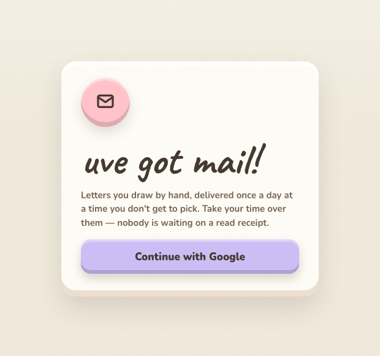

# uve got mail!

**A deliberately slow messaging app.** Letters don't arrive when you send them — they pile up and land all at once, at a time the recipient can't predict.

🔗 **[Live demo](https://uve-got-mail-frontend-ami7.onrender.com)** · Built at **SYNCS Hackathon 2026**

<p align="center">
  
</p>

---

## Inspiration

The intentionality behind every letter written in the old days, paired with the modern convenience of digital messaging — striking a balance between mindful interactions and whimsy.

## What it does

A delayed-gratification notes app that promotes mindful intention in how you interact with your friends online.

**uve got mail!** is a deliberately slow "messaging" application where mail arrives in bulk, at a scheduled time of day.

Users write **digital letters** on a canvas, and they don't reach the recipient until that person's scheduled mail delivery. The slow pace forces you to be intentional about what you put in a letter, and to appreciate the ones you receive.

Letters also replay **stroke by stroke**, so you watch the letter being written exactly as it was drawn.

## How delivery works

This is the heart of the app, and it's the part worth reading before changing anything.

- Letters do **not** arrive when sent. They accumulate and the whole batch lands at once.
- Every user has a **random delivery time**, assigned at account creation and re-randomised to a new time the following day after each delivery.
- A delivered batch stays **re-readable** until the next delivery, which retires it.
- The inbox shows **one letter at a time**, navigable like a gallery, oldest first. Scarcity is the point.

Two booleans on `Mail` define which of three states a letter is in. The inbox window is the middle one, and only the middle one:

| State | `received` | `archived` | Meaning |
|---|---|---|---|
| **In flight** | `false` | `false` | Sent, but invisible to the recipient. Waiting for their delivery time. |
| **Current window** | `true` | `false` | What `GET /mail` returns. Readable and re-readable. |
| **Retired** | `true` | `true` | Pushed out by the next delivery. Gone from the inbox for good. |

A `node-cron` job runs a delivery pass every minute. For each user whose scheduled time has passed, one transaction archives the current window, marks pending letters as received, and rolls `scheduledMail` forward to a random time the next day within an **08:00–20:00** local window.

> The cron runs **per process**. Scaling the backend to multiple instances would double-deliver — it would need `node-cron`'s distributed mode first.

## Tech stack

**Backend** — Node.js · Express 5 · TypeScript · Prisma 7 · PostgreSQL · Supabase (Google OAuth) · node-cron · Helmet · Swagger / OpenAPI

**Frontend** — React · Vite · TypeScript · Tailwind CSS 4 · Radix UI · Framer Motion · tldraw (canvas + stroke recording)

**Infra** — Docker Compose (local) · Render Blueprint (`render.yaml`, production)

## Repo layout

```
BE/                     Express + Prisma backend
  prisma/schema.prisma  MailUser, Mail, Recording, History, FriendRequest
  src/
    controllers/        auth · mail · mailUser · friendRequest · giphy · recording · delivery
    services/           deliveryService.ts  <- the scheduled delivery logic
    middlewares/        authMiddleware.ts (Supabase JWT -> req.dbUser)
    routes/             route definitions
    docs/               hand-written OpenAPI spec
FE/                     React + Vite frontend
  src/components/       LetterCanvas, Inbox, dialogs, UI primitives
  src/api.ts            typed backend client
docker-compose.yml      local dev stack
render.yaml             production blueprint (2 services)
```

## Getting started

You'll need a **Supabase project** (for auth and Postgres) and a **Giphy API key**.

### Option A — Docker Compose

The compose stack runs the same dev servers you'd run on the host, with source bind-mounted so edits reload live. There's no database container: `DATABASE_URL` points at your hosted Supabase instance, so the containers only need outbound network.

```bash
cp BE/.env.example BE/.env    # then fill it in — see below
cp FE/.env.example FE/.env

docker compose up --build
```

- Frontend → http://localhost:5173
- Backend → http://localhost:8888
- API docs → http://localhost:8888/api-docs

The frontend waits for the backend's `/health` check before starting, so the Vite proxy always has something to talk to. First boot runs `prisma generate` and compiles through `ts-node`, so give it up to a minute.

```bash
docker compose down -v       # -v also refreshes the node_modules volumes
```

### Option B — run locally

Two terminals:

```bash
# Terminal 1 — backend (http://localhost:8888)
cd BE
pnpm install
pnpm prisma generate
pnpm prisma migrate deploy
pnpm dev

# Terminal 2 — frontend (http://localhost:5173)
cd FE
npm install
npm run dev
```

Vite reads the backend's port straight out of `BE/.env` rather than duplicating it, so the proxy can't drift out of sync.

## Environment variables

**`BE/.env`**

| Variable | Required | Purpose |
|---|:---:|---|
| `DATABASE_URL` | ✅ | Postgres connection string (Supabase) |
| `SUPABASE_URL` | ✅ | Supabase project URL |
| `SUPABASE_ANON_KEY` | ✅ | Supabase anon key, for token verification |
| `GIPHY_API_KEY` | ✅ | Powers the GIF picker |
| `DELIVERY_SECRET` | ✅ | Shared secret guarding the manual delivery trigger |
| `PORT` | — | Defaults to `3000`; compose sets `8888` |

**`FE/.env`**

| Variable | Required | Purpose |
|---|:---:|---|
| `VITE_SUPABASE_URL` | ✅ | Supabase project URL |
| `VITE_SUPABASE_ANON_KEY` | ✅ | Supabase anon key |
| `VITE_TLDRAW_LICENSE_KEY` | — | Removes the tldraw watermark |

`VITE_*` variables are **inlined at build time**, so they must be set before `npm run build` — unlike the backend's, which are read at runtime.

## API

All `/mail` and `/friends` routes require a Supabase bearer token.

| Method | Route | Description |
|---|---|---|
| `GET` | `/health` | Liveness check |
| `GET` | `/api-docs` | Swagger UI |
| `POST` | `/auth/callback` | Completes Supabase social sign-in, upserts the user |
| `GET` | `/mail` | Current inbox window, oldest first |
| `POST` | `/mail/:recipientId` | Send a letter (raw canvas recording, ≤25 MB) |
| `GET` | `/mail/:id` | Fetch one letter |
| `PUT` | `/mail/:id/read` | Clear the unread badge (recipient only) |
| `GET` | `/user/by-username/:username` | Look up a user by username |
| `GET` | `/user/me/friends` | Friends list, unioned across both sides of the relation |
| `POST` | `/user/:id/username` | Set username |
| `GET` | `/friends` | Pending friend requests |
| `POST` | `/friends/send/:username` | Send a friend request |
| `PUT` | `/friends/:id/accept` | Accept |
| `PUT` | `/friends/:id/decline` | Decline |
| `GET` | `/giphy/search` | GIF search, behind a TTL cache |
| `POST` | `/delivery/run` | Run a delivery pass. Requires the `DELIVERY_SECRET` header |
| `GET` | `/sendNow` | **Demo trigger.** Delivers everything immediately — see below |

`POST /delivery/run` is guarded by a timing-safe secret comparison and returns **503** when `DELIVERY_SECRET` is unset, so an unconfigured deployment can't have its schedule driven by anyone who finds the route. It's mounted outside `/mail` on purpose — `POST /mail/:recipientId` would otherwise match the path as a recipient id.

### Demo mode

Waiting for a randomly-scheduled delivery doesn't make for a good demo, so `GET /sendNow` short-circuits it:

```
GET /sendNow
```

It delivers **all pending mail for every account right now**, regardless of each user's `scheduledMail`, then rolls everyone forward to a fresh time the next day so the normal schedule resumes. `POST /delivery/run` only covers users who are already due; this one forces the issue.

Visiting the URL in a browser is enough to trigger it — that's the point, it's built for a live demo. Two consequences worth knowing:

- It acts on **every account**, not just yours.
- It's unauthenticated, so on a public deployment anything that fetches URLs (a crawler, a link preview) can set it off. Fine for a hackathon demo; add a secret before running this anywhere that matters.

## Deployment

`render.yaml` is a Render Blueprint defining both services:

- **Backend** — native Node runtime rather than Docker. The free tier's 512 MB / 0.1 CPU instance runs the compiled `dist/server.js` far more comfortably than an image carrying dev tooling.
- **Frontend** — a static site rather than a container running `vite dev`. Static sites are genuinely free, serve from Render's CDN, and never spin down.

Rewrite rules reproduce the Vite dev proxy in production, so the frontend's relative fetches keep working unchanged. `buildFilter` scopes each service to its own directory so a frontend change doesn't rebuild the backend, and every secret is marked `sync: false` so nothing sensitive lives in the blueprint.

## Notes and limitations

- The delivery cron is **single-process** — see the note above before scaling out.
- The delivery window is hardcoded to **08:00–20:00 server-local** (`WINDOW_START_HOUR` / `WINDOW_END_HOUR` in `deliveryService.ts`).
- Canvas recordings are capped at **25 MB** per letter.
- Recordings are stored as `Bytes` in Postgres rather than object storage — fine at hackathon scale, the first thing to move under real load.

---

Built in 24 hours at **SYNCS Hackathon 2026**.
